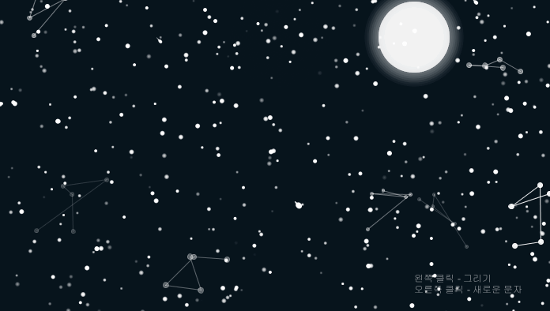

# 밤 하늘에 쓰여진 별들(Stars written in the night sky)

 
 
  
   

 
<b>프로젝트 목적</b> 
Processing을 이용하여 사용자의 입력에 따라서 반응하는 작품 만들기<a href="http://puzzleleaf.tistory.com/129">[링크]</a> 
 
<b>프로젝트 설명</b> 
밤 하늘을 배경으로 별들을 이용하여 문자들을 구성할 수 있다. 
밤 하늘이라는 주제에 맞게 <b>별, 별자리, 별똥별, 달</b> 효과가 구현되어 있다. 
<b>마우스 왼쪽</b> 버튼을 누르고 있으면 별들이 마우스의 궤적을 따라서 그려진다. 
<b>마우스 오른쪽 버튼</b>을 누르면 미리 지정해둔 다음 문자들이 화면에 그려진다. 

 
 
  
   

 
<b>상세</b> 
1. 별 : 별 효과는 각 별에 대해서 현재 좌표 값과 색상 값을 가진 객체를 생성하고 ellipse를 이용하여 그려준다. 화면에 랜덤한 위치에 별이 그려지고 색상 값이 변하게 되는데 화면에서 보이지 않게 되는 경우 새로운 랜덤한 위치에 그려주는 원리이다. 
 
2. 별자리 : 임의의 별 객체의 좌표 값에서 인접한 위치에 몇 개의 별을 생성하고 그 별들을 연결함으로써 별자리처럼 
그려주는 효과를 구현했다. 
 
3. 별똥별 : 임의의 별 객체의 x좌표와 y좌표의 값을 증가시켜 우측 대각선 방향으로 떨어지도록 구현했다. 
 
4. 달 : ellipse를 이용하여 흰색 원을 그리고 배경색과 동일한 또 다른 원을 그려서 이것을 이동시켜서 달 모양이 변하는 효과를 구현했다. 
 
5. 문자 애니메이션 : 문자를 화면에 그려주는 경우 화면에서 나타나는 픽셀들의 위치와 색상 값을 따로 저장한다.
이후에 저장해둔 위치 값을 목적지로 임의의 위치에서 점을 찍고 목적지 방향으로 힘을 가해서 점이 목적지의 위치로 이동하도록 구현했다. 

